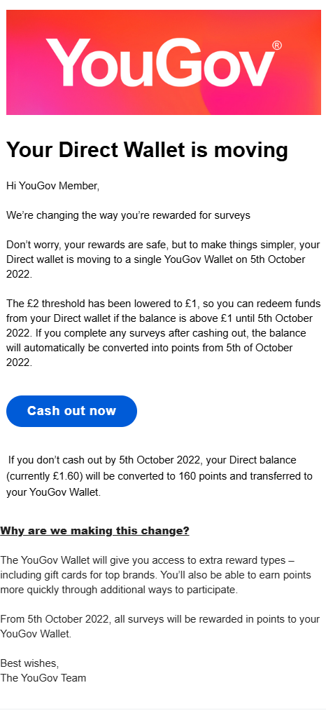

# Customer Communications at YouGov

## Overview

Worked on customer-facing communications (September 2022) related to YouGov's survey panel and member communications.

## Audience

- Survey panel members

## What I worked on

- Customer email communications
- Improving readability and tone
- Structuring information for non-technical audiences

## Challenges

- Communicating clearly to a broad audience
- Maintaining consistency in tone and messaging
- Balancing clarity with brevity

## Decisions

- Prioritised plain language and scannability
- Focused on approachable and concise communication
- Structured content to support quick comprehension

## Tools and workflows

- Customer communications
- Content editing
- Cross-functional collaboration

## Sample

